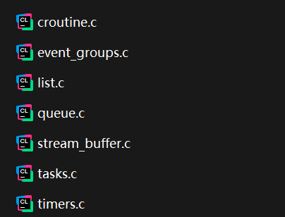

# 下载官方文件
[FreeRTOS](https://www.freertos.org/)
# 文件说明
## **内核**文件夹（重点关注）

## 核心代码

1. croutine.c：协程相关文件（不用）
2. event_groups.c：事件相关（次要）
3. list.c：列表（重要）
4. queue.c：队列（重要）
5. stream_buffer.c：流式缓冲区（次要）
6. tasks.c：任务文件(重要)
7. timers.c：定时器相关（次要）
## portable文件夹
用于移植
### MemMang(必须)
内存管理，一般选择版本4
### Keil或GCC（必须）
### RVDS(Keil必须)
Keil或GCC的底层，不同内核芯片的移植文件
# 移植步骤
## CubeMx一键配置
### 接口

选择版本V2，更好。
- 选择 FreeRTOS 后，右侧会多出一个 `FREERTOS` 的配置页签。
  
- 在这里，你可以完全通过图形界面配置所有 FreeRTOS 参数，无需手动修改 `FreeRTOSConfig.h` 文件：
  
    - **任务和队列**：设置内核对象数量，如 `configTOTAL_HEAP_SIZE`（非常重要！）。
      
    - **钩子函数**：使能或禁止空闲任务钩子、定时器钩子等。
      
    - **内存管理**：选择堆分配方案（Heap 1~5）。
      
    - **Include parameters**：配置 `configUSE_PREEMPTION`（是否使用抢占式调度）、`configCPU_CLOCK_HZ`（CPU 频率，通常会自动设置好）、`configTICK_RATE_HZ`（系统时钟节拍频率，通常设为 1000Hz，即 1ms 一个节拍）。
### 协处理器

#### 内存保护
MPU 是一个硬件单元，它允许操作系统（如 FreeRTOS）为不同的任务或进程**设置内存访问权限**。你可以把它想象成一颗芯片内部的“内存卫士”。
#### 浮点运算
FPU 是一个专门用于处理**浮点数**（小数）计算的硬件单元。没有 FPU 的 CPU 只能通过软件库来模拟浮点运算，这非常缓慢。FPU 则像是一个数学计算器，能直接在硬件上高速执行 `+`, `-`, `*`, `/` 甚至更复杂的三角函数、对数等运算。
### Kernal Settings(Config)

- 选择 FreeRTOS 后，右侧会多出一个 `FREERTOS` 的配置页签。在这里，你可以完全通过图形界面配置所有 FreeRTOS 参数，无需手动修改 `FreeRTOSConfig.h` 文件。

  #### <u>preemptive scheduler</u>

  配置 `configUSE_PREEMPTION`（是否使用抢占式调度）、`configCPU_CLOCK_HZ`（CPU 频率，通常会自动设置好）、`configTICK_RATE_HZ`（系统时钟节拍频率，通常设为 1000Hz，即 1ms 一个节拍）。

  #### **<u>任务和队列</u>**

  设置内核对象数量，如 `configTOTAL_HEAP_SIZE`（非常重要！）。

  #### **<u>内存管理</u>**

  选择堆分配方案（Heap 1~5）。

  #### <u>**USE_SB_COMPLETED_CALLBACK**</u>

  "SB" 代表 "Space Block"。这个选项用于启用或禁用 **"半传输完成回调函数"**。

  #### **<u>USE_MINI_LIST_ITEM**</u> 

  是否启用**链表优化**

  FreeRTOS 内核大量使用**链表**来管理其内核对象，例如：

  - **就绪列表**：管理所有准备运行的任务。
  - **阻塞列表**：管理所有正在延迟或等待事件（如信号量、队列）的任务。
  - **挂起列表**：管理被挂起的任务。

  这些链表中的每一个元素都是一个 `ListItem_t` 结构体。每当一个任务被创建时，它都会包含多个 `ListItem_t` 成员（例如 `xStateListItem` 用于放入就序/阻塞/挂起列表，`xEventListItem` 用于事件列表）。
  
  ##### 标准的 `ListItem_t`

  一个标准的 `ListItem_t` 结构体（在 `list.h` 中定义）通常包含以下成员：

  ```c
  // 标准的列表项结构
  struct xLIST_ITEM {
      TickType_t xItemValue;               // 主要值，用于在列表中排序（例如，唤醒时间戳）
      struct xLIST_ITEM * pxNext;          // 指向链表中下一个列表项的指针
      struct xLIST_ITEM * pxPrevious;      // 指向链表中上一个列表项的指针
      void * pvOwner;                      // 指向拥有这个列表项的对象（通常是任务控制块 TCB）
      void * pvContainer;                  // 指向这个列表项所属的列表
  };
  // 在 32 位架构上，这通常是 20 字节。
  ```
  
  
  
  ##### `USE_MINI_LIST_ITEM` 是什么？
  
  `USE_MINI_LIST_ITEM` 是一个在 `FreeRTOSConfig.h` 中定义的编译时配置选项。

  - **`#define USE_MINI_LIST_ITEM 0` （默认）**：使用上面描述的**标准** `ListItem_t` 结构体。
  - **`#define USE_MINI_LIST_ITEM 1`**：使用一个**精简版**的 `ListItem_t` 结构体，通常被称为 `MiniListItem_t`。
  
  ##### 精简版列表项
  
  `MiniListItem_t` 移除了某些成员，以节省内存。它通常只包含：
  
  ```c
  // 精简版列表项结构
  struct xMINI_LIST_ITEM {
      TickType_t xItemValue;               // 保留：用于排序的主要值
      struct xLIST_ITEM * pxNext;          // 保留：指向下一个列表项
      struct xLIST_ITEM * pxPrevious;      // 保留：指向上一个列表项
  };
  // 在 32 位架构上，这通常是 12 字节（比标准版节省了 8 字节）。
  ```
  你可能会注意到，它移除了：
  
  - `pvOwner`：指向拥有者的指针。
  - `pvContainer`：指向所属列表的指针。
  
  ##### 用途和限制
  
  **为什么需要精简版列表项？**
  
  精简版列表项**并非用于任务**，而是专门用于**列表的“末尾”或“结束”标记**。

  在 FreeRTOS 的链表实现中，每个列表都有一个**“列表尾”** 或 **“结束标记”**。这个标记本身也是一个 `ListItem_t`，但它不归属于任何任务或内核对象。它的唯一作用是：

  - 表示列表的结束。
  - 其 `xItemValue` 被设置为可能的最大值（`portMAX_DELAY`），以确保它在按值排序的列表中始终处于末尾位置。
  
  因为这个“结束标记”列表项没有“拥有者”，也不关心自己属于哪个“容器”（它本身就是容器的一部分），所以使用完整的 `ListItem_t` 是对内存的浪费。因此，FreeRTOS 使用 `MiniListItem_t` 来创建这个结束标记，从而节省宝贵的内存。
  
  #### <u>MINIMAL_STACK_SIZE</u>
  `MINIMAL_STACK_SIZE` 是 FreeRTOS 中一个非常重要且基础的配置选项。它定义了**空闲任务**和（在某些配置下）**定时器服务任务**所使用的**最小栈深度**。作为新手，我们只了解它经验值位128字。
  
  #### <u>IDLE_SHOULD_YIELD</u>
  当有**其他用户任务**与空闲任务**处于同一优先级（即优先级 0）** 时，空闲任务在它的时间片结束后是否应该**立即让出** CPU。
  
  #### <u>ENABLE_BACKWARD_COMPATIBILITY</u>  
  
  是否启用**向后版本兼容**，启用则旧版本的代码能够正常使用。
  
  #### <u>USE_TICKLESS_IDLE</u>
  
  tickless，通常被称为 **"无滴答空闲模式"** 或 **"低功耗滴答模式"**。新手不需要启用这个。
  
  #### <u>USE_TASK_NOTIFICATIONS</u>
  
  是否启用 **任务通知** 功能，默认情况下，这个选项是启用的。 除非你出于极特殊的原因（比如要节省 TCB 中那几个字节的内存），否则永远不要禁用它。
  
  #### <u>RECORD_STACK_HIGH_ADDRESS</u>  
  
  提供了更精确的栈分析信息。先不管。
  
  ### **Hook Function  钩子函数**
  
  使能或禁止空闲任务钩子、定时器钩子等。
  
  **钩子函数** 是 FreeRTOS 中一个非常强大的特性，它允许你在**内核的关键执行点**插入自己的回调函数。这为调试、性能分析、低功耗管理和功能扩展提供了极大的灵活性。
  
  ```c
  configUSE_IDLE_HOOK //是否启用空闲任务钩子函数。这是一个由用户实现的回调函数，当 FreeRTOS 的空闲任务运行时，这个函数会被自动且反复地调用。
  configUSE_TICK_HOOK //高级功能,在 SysTick 中断服务程序 内部被调用。
  ...
  ```
  
  ### Run time and task stats gathering  **运行时和任务统计信息收集**
  
  #### 1. 启用任务统计 **`configUSE_TRACE_FACILITY`**
  
  这是最基础的配置，它为任务控制块（TCB）添加了统计信息所需的字段。
  
  ```c
  #define configUSE_TRACE_FACILITY 1
  ```
  
  **作用**：
  
  - 在 TCB 中添加了 `ulRunTimeCounter` 字段，用于记录任务的累计运行时间。
  - 为调试器可视化提供更多任务状态信息。
  
  #### 2. 启用运行时统计 **`configGENERATE_RUN_TIME_STATS`**
  
  这个宏控制是否计算每个任务的 CPU 使用率。
  
  ```c
  #define configGENERATE_RUN_TIME_STATS 1
  ```
  
  **作用**：
  
  - 启用任务运行时统计计算。
  - **需要你实现两个宏**来提供计时功能。
  
  #### 3. 启用任务状态查询 **`configUSE_STATS_FORMATTING_FUNCTIONS`**
  
  这个宏启用了一些用于格式化输出统计信息的实用函数。
  
  ```c
  #define configUSE_STATS_FORMATTING_FUNCTIONS 1
  ```
  
  **作用**：
  
  - 启用了 `vTaskList()` 和 `vTaskGetRunTimeStats()` 等函数。
  - 这些函数可以将统计信息格式化为可读的字符串。
  
  ### Software Timer
  
  **软件定时器** 是 FreeRTOS 中一个非常重要的功能，它允许你在应用程序中创建和管理多个虚拟定时器，而无需使用硬件定时器外设
  
  CubeMx给我们优先级是2，只高于优先级1和空闲任务（优先级0），适于简单应用。一般这个优先级要调高一点。
## 手动移植
### 1. 添加FreeRTOS源码
将源码添加入工程，不同IDE不一样
### 2. FreeRTOSConfig.h
配置文件
### 3. 修改SYSTEM文件
### 4. 修改中断相关文件
### 5. 添加应用程序
