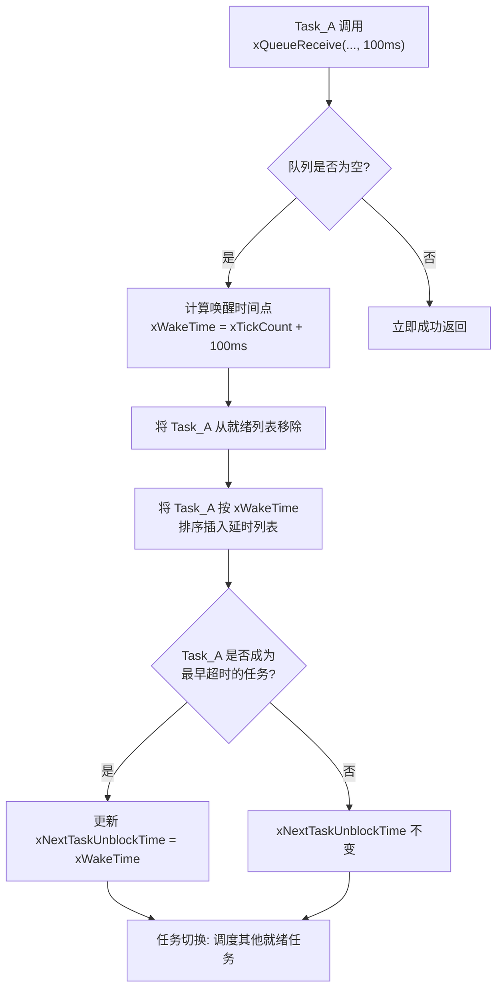

[TOC]
# 队列的基本概念与特性

队列(queue)是FreeRTOS中最基础的任务间通信机制，可以用于"任务到任务"、"任务到中断"、"中断到任务"直接传输信息。具有以下核心特性：

**先进先出(FIFO)**：数据按照发送的顺序依次被接收，保证数据顺序性

**线程安全**：多个任务可以同时向队列读写数据而不会产生数据竞争

**数据拷贝**：队列在传递数据时进行完整的数据复制，而非传递指针

**阻塞机制**：当队列空时读取任务可以阻塞等待，队列满时写入任务可以阻塞等待

**多任务同步**：天然支持生产者-消费者模式的任务同步

**基础**

- 队列可以包含若干个数据：队列中有若干项，这被称为"长度"(length)
- 每个数据大小固定
- 创建队列时就要指定长度、数据大小
- 数据的操作采用先进先出的方法(FIFO，First In First Out)：写数据时放到尾部，读数据时从头部读
- 也可以强制写队列头部：覆盖头部数据

# 传输数据的方法

使用队列传输数据时有两种方法：

- 拷贝：把数据、把变量的值复制进队列里
- 引用：把数据、把变量的地址复制进队列里

FreeRTOS使用拷贝值的方法，这更简单：

- 局部变量的值可以发送到队列中，后续即使函数退出、局部变量被回收，也不会影响队列中的数据
- 无需分配buffer来保存数据，队列中有buffer
- 局部变量可以马上再次使用
- 发送任务、接收任务解耦：接收任务不需要知道这数据是谁的、也不需要发送任务来释放数据
- 如果数据实在太大，你还是可以使用队列传输它的地址
- 队列的空间有FreeRTOS内核分配，无需任务操心
- 对于有内存保护功能的系统，如果队列使用引用方法，也就是使用地址，必须确保双方任务对这个地址都有访问权限。使用拷贝方法时，则无此限制：内核有足够的权限，把数据复制进队列、再把数据复制出队列。

# 队列的阻塞访问

只要知道队列的句柄，谁都可以读、写该队列。任务、ISR都可读、写队列。可以多个任务读写队列。

任务读写队列时，简单地说：如果读写不成功，则阻塞；可以指定超时时间。口语化地说，就是可以定个闹钟：如果能读写了就马上进入就绪态，否则就阻塞直到超时。

## 写队列

某个任务读队列时，如果队列没有数据，则该任务可以进入阻塞状态：还可以指定阻塞的时间。如果队列有数据了，则该阻塞的任务会变为就绪态。如果一直都没有数据，则时间到之后它也会进入就绪态。

## 优先级

既然读取队列的任务个数没有限制，那么当多个任务读取空队列时，这些任务都会进入阻塞状态：有多个任务在等待同一个队列的数据。当队列中有数据时，哪个任务会进入就绪态？

- 优先级最高的任务
- 如果大家的优先级相同，那等待时间最久的任务会进入就绪态

## 读队列

跟读队列类似，一个任务要写队列时，如果队列满了，该任务也可以进入阻塞状态：还可以指定阻塞的时间。如果队列有空间了，则该阻塞的任务会变为就绪态。如果一直都没有空间，则时间到之后它也会进入就绪态。

既然写队列的任务个数没有限制，那么当多个任务写"满队列"时，这些任务都会进入阻塞状态：有多个任务在等待同一个队列的空间。当队列中有空间时，哪个任务会进入就绪态？

- 优先级最高的任务
- 如果大家的优先级相同，那等待时间最久的任务会进入就绪态

# 队列基本

## `QueueHandle_t`

队列句柄类型，指向队列控制块的指针。

## `Queue_t`

队列控制块类型。

```c
typedef struct QueueDefinition
{
    // ---------------- 存储区管理 ----------------
    int8_t *pcHead;           // 指向队列存储区的起始地址（队列开始）
    int8_t *pcTail;           // 指向队列存储区的结束地址的下一个字节（队列结束之后）
    int8_t *pcWriteTo;        // 指向下一个写入数据的位置
    
    // ---------------- 读取位置管理 ----------------
    union
    {
        int8_t *pcReadFrom;   // 当用作队列时，指向下一个读取数据的位置
        UBaseType_t uxRecursiveCallCount; // 当用作互斥量时，用于递归调用计数
    } u;

    // ---------------- 任务等待列表（核心同步机制） ----------------
    // 当任务因读取（接收）而阻塞时，会挂到这个列表上（例如：队列空）
    List_t xTasksWaitingToReceive;
    // 当任务因写入（发送）而阻塞时，会挂到这个列表上（例如：队列满）
    List_t xTasksWaitingToSend;

    // ---------------- 队列状态信息 ----------------
    volatile UBaseType_t uxMessagesWaiting; // 当前队列中已有的消息数量
    UBaseType_t uxLength;                   // 队列创建时设定的最大长度（项目数）
    UBaseType_t uxItemSize;                 // 每个项目的大小（字节数）

    // ---------------- 类型标识 ----------------
    // 标识这个队列对象的类型：队列、互斥量、信号量等。
    // 这允许同一个内核函数（如 xQueueGenericSend）处理多种对象。
    int8_t cRxLock;          // 从队列接收时使用的锁计数（在中断中）
    int8_t cTxLock;          // 向队列发送时使用的锁计数（在中断中）

    #if ( ( configSUPPORT_STATIC_ALLOCATION == 1 ) && ( configSUPPORT_DYNAMIC_ALLOCATION == 1 ) )
        uint8_t ucStaticallyAllocated; // 标识队列内存是静态还是动态分配的
    #endif

    #if ( configUSE_QUEUE_SETS == 1 )
        // 如果启用队列集，这个指针用于将队列与一个队列集关联
        struct QueueDefinition *pxQueueSetContainer;
    #endif

    #if ( configUSE_TRACE_FACILITY == 1 )
        UBaseType_t uxQueueNumber; // 用于跟踪调试的队列编号
        uint8_t ucQueueType;       // 用于跟踪调试的队列类型
    #endif

} Queue_t;
```

## 阻塞唤醒

非常好！FreeRTOS 的超时唤醒机制是其实时性的核心保障之一，它的实现非常精巧。这个机制**不仅仅用于队列，而是用于所有可能引起任务阻塞的场合**，如信号量、事件组、任务通知等。

---

### 核心思想：硬件定时器 + 排序列表

FreeRTOS 利用一个硬件定时器（通常是 SysTick）作为心跳，并维护了一个**按超时时间排序的列表**，称为 **"等待未到期列表"** 或 **"延时列表"**。

---

### 1. 关键数据结构

#### a) 两个重要的列表

1.  **`xDelayedTaskList1` 和 `xDelayedTaskList2`**
    - 这两个列表**按唤醒时间（超时到期时间）排序**，时间最近的排在前面。
    - 为什么要两个列表？这是为了在系统心跳中断中进行安全的列表切换，一个给内核使用（`pxDelayedTaskList`），另一个给中断使用（`pxOverflowDelayedTaskList`），用于处理系统滴答计数器溢出的情况。从应用程序视角，我们可以将它们视为一个整体的“延时列表”。

2.  **`xPendingReadyList`**
    - 这是一个“挂起就绪列表”。当任务因为超时或事件发生而需要被解除阻塞，但解除操作发生在**中断服务程序**中时，任务不会被直接移到就绪列表（因为不能在中断中进行调度决策），而是先放到这个列表中。

#### b) 核心变量

- **`xTickCount`**：
  - 这是系统的**心跳计数器**，每次硬件定时器中断发生，它就加一。它是整个系统的时间基准。
- **`xNextTaskUnblockTime`**：
  - 这是一个**全局优化变量**，记录了**整个系统中下一个将要超时的任务的时间点**。
  - 这个变量至关重要，它告诉调度器：“在 `xNextTaskUnblockTime` 之前，绝对不会有任务因超时而醒来”。这意味着在 `xNextTaskUnblockTime` 之前，调度器可以放心地让 CPU 进入低功耗的 IDLE 状态。

---

### 2. 超时唤醒的实现流程

整个过程可以分为 **“设置阻塞”** 和 **“超时检查”** 两个阶段。

#### 阶段一：任务设置阻塞并启动超时倒计时

当一个任务（例如 `Task_A`）调用 `xQueueReceive(..., 100ms)` 时，如果队列为空，它会进入阻塞状态。内核会执行以下操作：

1.  **计算唤醒时间点**：
    - `xWakeTime = xTickCount + pdMS_TO_TICKS(100)`
    - 将当前时间 `xTickCount` 加上超时时间，计算出未来的唤醒时间点 `xWakeTime`。

2.  **将任务挂入延时列表**：
    - 将 `Task_A` 从**就绪列表**中移除。
    - 根据计算出的 `xWakeTime`，将 `Task_A` 按照顺序插入到 **延时列表** 中。这个列表是按 `xWakeTime` **升序排列**的。

3.  **更新下一个唤醒时间**：
    - 由于 `Task_A` 被插入到延时列表，内核会检查它是否成为了列表中超时时间最早的任务（即是否在列表首部）。
    - 如果是，则更新全局变量 `xNextTaskUnblockTime` 为 `Task_A` 的 `xWakeTime`。



#### 阶段二：系统心跳中断进行超时检查

每次 SysTick 定时器中断发生时，`xTaskIncrementTick()` 函数会被调用。它负责：

1.  **递增时间基准**：
    - `xTickCount = xTickCount + 1`

2.  **检查是否到达超时时间**：
    - 它比较当前的 `xTickCount` 和 `xNextTaskUnblockTime`。
    - **如果 `xTickCount < xNextTaskUnblockTime`**：说明还没有任务需要被唤醒，直接返回。
    - **如果 `xTickCount >= xNextTaskUnblockTime`**：说明**至少有一个**任务超时时间已到。

3.  **唤醒超时任务**：
    - 内核遍历**延时列表**，将所有 `xWakeTime <= xTickCount` 的任务都从列表中移除。
    - 对于每个被移除的任务：
        - **如果它在等待一个资源（如队列）**：说明它是因为**超时**而醒来，而不是因为等到了数据。因此，内核会将它从该资源的等待列表（如队列的 `xTasksWaitingToReceive`）中也移除掉。
        - **将任务重新放回就绪列表**。

4.  **更新下一个唤醒时间**：
    - 在处理完所有超时任务后，延时列表的新头部（如果列表不为空）就是下一个要超时的任务。
    - 更新 `xNextTaskUnblockTime` 为这个新头部的超时时间。如果列表为空，则 `xNextTaskUnblockTime` 被设置为一个最大值，表示“没有任务在等待超时”。

---

### 3. 超时与事件同时到达的竞争处理

一个关键问题是：如果一个任务在等待队列数据，同时超时时间也到了，会怎样？

- **事件（数据到达）先于超时**：
    - 另一个任务发送了数据，内核将 `Task_A` 从队列的等待列表和延时列表中**同时移除**，并放入就绪列表。`Task_A` 成功获得数据。
- **超时先于事件**：
    - SysTick 中断发现 `Task_A` 超时，将其从延时列表和队列的等待列表中移除，并放入就绪列表。当 `Task_A` 运行时，`xQueueReceive` 会返回 `errQUEUE_EMPTY` 或 `pdFALSE`，告知调用者超时发生了。

**内核保证了操作的原子性**，所以一个任务只会因为**一个原因**（要么事件，要么超时）被唤醒，不会出现混乱。

---

### 总结

FreeRTOS 的超时唤醒机制可以概括为：

| 组件                       | 作用                                                         |
| :------------------------- | :----------------------------------------------------------- |
| **SysTick 定时器**         | 提供系统心跳，驱动时间前进。                                 |
| **`xTickCount`**           | 系统时间基准。                                               |
| **延时列表**               | 一个按超时时间**排序**的列表，管理所有阻塞中的任务。         |
| **`xNextTaskUnblockTime`** | **性能关键**：记录下一个超时点，让调度器在空闲时能进入低功耗模式。 |
| **`xTaskIncrementTick()`** | **核心函数**：在每次心跳中断中被调用，检查并处理超时任务。   |

这种基于**排序列表**和**全局最小超时时间**的设计，使得超时检查非常高效（O(1) 的快速检查），是 FreeRTOS 适合资源受限但实时性要求高的嵌入式系统的原因之一。

# FreeRTOS
## 队列创建函数

### xQueueCreate - 动态创建队列

```c
QueueHandle_t xQueueCreate(UBaseType_t uxQueueLength, 
                          UBaseType_t uxItemSize);
```

**参数说明**：
- `uxQueueLength`：队列能够存储的最大项目数量
- `uxItemSize`：每个项目的大小，以字节为单位

**返回值**：
- 成功：返回队列句柄
- 失败：返回NULL（内存不足时）

**创建示例**：
```c
// 创建存储10个整数的队列
QueueHandle_t xIntQueue = xQueueCreate(10, sizeof(int));

// 创建存储5个浮点数的队列  
QueueHandle_t xFloatQueue = xQueueCreate(5, sizeof(float));

// 创建存储自定义结构体的队列
typedef struct {
    uint8_t command;
    uint32_t parameter;
    TickType_t timestamp;
} Command_t;
QueueHandle_t xCommandQueue = xQueueCreate(8, sizeof(Command_t));
```

### xQueueCreateStatic - 静态创建队列

```c
QueueHandle_t xQueueCreateStatic(UBaseType_t uxQueueLength,
                                UBaseType_t uxItemSize,
                                uint8_t *pucQueueStorageBuffer,
                                StaticQueue_t *pxQueueBuffer);
```

**参数说明**：
- `pucQueueStorageBuffer`：指向队列存储区的指针
- `pxQueueBuffer`：指向队列控制结构体的指针

**静态创建示例**：
```c
// 预分配存储区和控制结构
#define QUEUE_LENGTH 5
#define ITEM_SIZE sizeof(int)

static uint8_t ucQueueStorage[QUEUE_LENGTH * ITEM_SIZE];
static StaticQueue_t xQueueBuffer;

// 静态创建队列
QueueHandle_t xStaticQueue = xQueueCreateStatic(QUEUE_LENGTH,
                                               ITEM_SIZE,
                                               ucQueueStorage,
                                               &xQueueBuffer);
```

## 队列复位与删除函数

### vQueueReset - 队列复位

```c
void vQueueReset(QueueHandle_t xQueue);
```

**功能**：将队列重置为空状态，清除所有数据

**注意事项**：
- 复位时不会唤醒正在等待队列的任务
- 需要在确保没有任务使用队列时调用
- 谨慎使用，可能造成数据丢失

### vQueueDelete - 队列删除

```c
void vQueueDelete(QueueHandle_t xQueue);
```

**使用场景**：
- 动态创建的队列不再需要时释放内存
- 系统重新配置时清理资源
- 应用程序关闭时清理

**删除示例**：
```c
void vCleanupResources(void) {
    if(xCommandQueue != NULL) {
        vQueueDelete(xCommandQueue);
        xCommandQueue = NULL;
    }
}
```

## 队列写入函数

### xQueueSend - 后端发送（标准FIFO）

```c
BaseType_t xQueueSend(QueueHandle_t xQueue,
                     const void *pvItemToQueue,
                     TickType_t xTicksToWait);
```

**阻塞行为**：
- `xTicksToWait = 0`：非阻塞，队列满立即返回
- `xTicksToWait = portMAX_DELAY`：无限阻塞，直到队列有空位
- `xTicksToWait = N`：阻塞N个时钟节拍

**使用示例**：
```c
int data = 42;
// 尝试发送，等待最多100ms
if(xQueueSend(xQueue, &data, 100 / portTICK_PERIOD_MS) != pdPASS) {
    printf("Send failed: queue full\n");
}
```

### xQueueSendToFront - 前端发送（LIFO）

```c
BaseType_t xQueueSendToFront(QueueHandle_t xQueue,
                            const void *pvItemToQueue,
                            TickType_t xTicksToWait);
```

**特点**：数据插入队列前端，实现后进先出行为

**应用场景**：
- 紧急消息需要优先处理
- 实现栈数据结构

### xQueueSendToBack - 后端发送

与`xQueueSend`功能完全相同，都是标准FIFO发送。

### xQueueOverwrite - 覆盖写入

```c
BaseType_t xQueueOverwrite(QueueHandle_t xQueue,
                          const void *pvItemToQueue);
```

**特点**：
- 专为长度为1的队列设计
- 如果队列已满，自动覆盖最老的数据
- 永远不会阻塞，总是成功

**适用场景**：
- 只需要最新数据的传感器采样
- 状态更新，只关心最新状态

### 中断安全写入函数

#### xQueueSendFromISR
```c
BaseType_t xQueueSendFromISR(QueueHandle_t xQueue,
                            const void *pvItemToQueue,
                            BaseType_t *pxHigherPriorityTaskWoken);
```

#### xQueueSendToFrontFromISR
```c
BaseType_t xQueueSendToFrontFromISR(QueueHandle_t xQueue,
                                   const void *pvItemToQueue,
                                   BaseType_t *pxHigherPriorityTaskWoken);
```

#### xQueueOverwriteFromISR
```c
BaseType_t xQueueOverwriteFromISR(QueueHandle_t xQueue,
                                 const void *pvItemToQueue,
                                 BaseType_t *pxHigherPriorityTaskWoken);
```

**pxHigherPriorityTaskWoken参数**：
- 如果写入操作唤醒了更高优先级的任务，该参数会被设置为pdTRUE
- 在中断退出前需要检查此参数，必要时手动进行上下文切换

**中断中使用示例**：
```c
void UART_IRQHandler(void) {
    BaseType_t xHigherPriorityTaskWoken = pdFALSE;
    char received_char;
    
    // 从UART读取字符
    received_char = UART->DR;
    
    // 发送到队列
    xQueueSendFromISR(xUartQueue, &received_char, &xHigherPriorityTaskWoken);
    
    // 必要时进行任务切换
    portYIELD_FROM_ISR(xHigherPriorityTaskWoken);
}
```

## 队列读取函数

### xQueueReceive - 接收并移除数据

```c
BaseType_t xQueueReceive(QueueHandle_t xQueue,
                        void *pvBuffer,
                        TickType_t xTicksToWait);
```

**功能**：从队列前端读取数据，读取后数据从队列中移除

**阻塞行为**：
- `xTicksToWait = 0`：非阻塞，队列空立即返回
- `xTicksToWait = portMAX_DELAY`：无限阻塞，直到队列有数据
- `xTicksToWait = N`：阻塞N个时钟节拍

**使用示例**：
```c
int received_data;

// 等待数据，最多等待500ms
if(xQueueReceive(xQueue, &received_data, 500 / portTICK_PERIOD_MS) == pdPASS) {
    printf("Received: %d\n", received_data);
} else {
    printf("No data received within timeout\n");
}
```

### xQueuePeek - 查看但不移除数据

```c
BaseType_t xQueuePeek(QueueHandle_t xQueue,
                     void *pvBuffer,
                     TickType_t xTicksToWait);
```

**特点**：
- 读取队列前端数据但不从队列中移除
- 多个任务可以同时查看相同数据
- 数据仍然保留在队列中供其他任务读取

**应用场景**：
- 多个任务需要监控相同数据
- 数据广播场景

### 中断安全读取函数

#### xQueueReceiveFromISR
```c
BaseType_t xQueueReceiveFromISR(QueueHandle_t xQueue,
                               void *pvBuffer,
                               BaseType_t *pxHigherPriorityTaskWoken);
```

#### xQueuePeekFromISR
```c
BaseType_t xQueuePeekFromISR(QueueHandle_t xQueue,
                            void *pvBuffer);
```

**注意**：`xQueuePeekFromISR`没有超时参数，因为中断中不应该阻塞。

## 队列查询函数

### uxQueueMessagesWaiting - 查询消息数量

```c
UBaseType_t uxQueueMessagesWaiting(QueueHandle_t xQueue);
```

**返回值**：队列中当前存储的消息数量

### uxQueueSpacesAvailable - 查询剩余空间

```c
UBaseType_t uxQueueSpacesAvailable(QueueHandle_t xQueue);
```

**返回值**：队列中剩余可用的空间数量

### 中断安全查询函数

#### uxQueueMessagesWaitingFromISR
```c
UBaseType_t uxQueueMessagesWaitingFromISR(QueueHandle_t xQueue);
```

### 查询函数使用示例

```c
void vQueueStatusMonitor(QueueHandle_t xQueue) {
    UBaseType_t uxMessages = uxQueueMessagesWaiting(xQueue);
    UBaseType_t uxSpaces = uxQueueSpacesAvailable(xQueue);
    UBaseType_t uxTotalLength = uxMessages + uxSpaces;
    
    printf("Queue Status: %d/%d messages (%.1f%% full)\n",
           uxMessages, uxTotalLength,
           (float)uxMessages / uxTotalLength * 100);
    
    // 根据队列状态调整行为
    if(uxSpaces == 0) {
        printf("Warning: Queue is full!\n");
    } else if(uxMessages == 0) {
        printf("Info: Queue is empty\n");
    }
}
```

#  CMSISv2 API

## osMessageQueueNew - 创建消息队列

```c
osMessageQueueId_t osMessageQueueNew(uint32_t msg_count, 
                                    uint32_t msg_size, 
                                    const osMessageQueueAttr_t *attr);
```

**参数说明**:

- `msg_count`: 队列容量（消息数量）
- `msg_size`: 每个消息的大小（字节）
- `attr`: 队列属性（名称、内存区域等）

**创建示例**:

```c
// 静态分配方式
static uint8_t queue_mem[10 * sizeof(my_data_t)];
static osMessageQueueId_t my_queue;

void create_queue_static(void) {
    osMessageQueueAttr_t attr = {
        .name = "StaticQueue",
        .cb_mem = &queue_mem,
        .cb_size = sizeof(queue_mem)
    };
    my_queue = osMessageQueueNew(10, sizeof(my_data_t), &attr);
}

// 动态分配方式
void create_queue_dynamic(void) {
    osMessageQueueAttr_t attr = {
        .name = "DynamicQueue"
    };
    my_queue = osMessageQueueNew(10, sizeof(my_data_t), &attr);
}
```


## osMessageQueuePut - 发送消息

```c
osStatus_t osMessageQueuePut(osMessageQueueId_t mq_id,
                            const void *msg_ptr,
                            uint8_t msg_prio,
                            uint32_t timeout);
```


**参数说明**:

- `mq_id`: 消息队列ID
- `msg_ptr`: 指向要发送的消息
- `msg_prio`: 消息优先级（通常为0）
- `timeout`: 超时时间（osWaitForever, 0, 或具体毫秒数）

**使用示例**:

```c
typedef struct {
    int sensor_id;
    float value;
    uint32_t timestamp;
} sensor_data_t;

void send_sensor_data(void) {
    sensor_data_t data = {1, 25.5f, osKernelGetTickCount()};
    
    osStatus_t status = osMessageQueuePut(sensor_queue, &data, 0, osWaitForever);
    if(status == osOK) {
        printf("Data sent successfully\n");
    } else {
        printf("Failed to send data: %d\n", status);
    }
}
```


## osMessageQueueGet - 接收消息

```c
osStatus_t osMessageQueueGet(osMessageQueueId_t mq_id,
                            void *msg_ptr,
                            uint8_t *msg_prio,
                            uint32_t timeout);
```


**使用示例**:

```c
void receive_sensor_data(void) {
    sensor_data_t received_data;
    uint8_t priority;
    
    osStatus_t status = osMessageQueueGet(sensor_queue, &received_data, &priority, 1000);
    if(status == osOK) {
        printf("Received: Sensor%d=%.1f at %lu\n", 
               received_data.sensor_id, received_data.value, received_data.timestamp);
    } else if(status == osErrorTimeout) {
        printf("No data received within timeout\n");
    } else {
        printf("Error receiving data: %d\n", status);
    }
}
```

## 其他队列管理函数

### osMessageQueueGetCount

```c
uint32_t osMessageQueueGetCount(osMessageQueueId_t mq_id);
```


### osMessageQueueGetSpace

```c
uint32_t osMessageQueueGetSpace(osMessageQueueId_t mq_id);
```

### osMessageQueueDelete

```c
osStatus_t osMessageQueueDelete(osMessageQueueId_t mq_id);
```

### osMessageQueueReset

```c
osStatus_t osMessageQueueReset(osMessageQueueId_t mq_id);
```

| 操作       | FreeRTOS                   | CMSIS-RTOS v2              |
| :--------- | :------------------------- | :------------------------- |
| 创建队列   | `xQueueCreate()`           | `osMessageQueueNew()`      |
| 发送队列   | `xQueueSend()`             | `osMessageQueuePut()`      |
| 接收队列   | `xQueueReceive()`          | `osMessageQueueGet()`      |
| 查询消息数 | `uxQueueMessagesWaiting()` | `osMessageQueueGetCount()` |
| 查询空间   | `uxQueueSpacesAvailable()` | `osMessageQueueGetSpace()` |
| 删除队列   | `vQueueDelete()`           | `osMessageQueueDelete()`   |
| 重置队列   | `vQueueReset()`            | `osMessageQueueReset()`    |

# 队列使用最佳实践总结

## 队列设计原则

**合理设置队列长度**：
- 根据数据产生速度和消费速度计算
- 考虑最坏情况下的数据积压
- 平衡内存使用和系统可靠性

**选择适当的数据类型**：
- 简单数据直接传递值
- 复杂数据使用结构体封装
- 大数据量考虑传递指针（需自行管理内存）

## 错误处理策略

**发送失败处理**：
```c
BaseType_t xResult = xQueueSend(xQueue, &data, timeout);
if(xResult != pdPASS) {
    // 处理策略：重试、丢弃、转存等
    handle_send_failure(data);
}
```

**接收超时处理**：
```c
if(xQueueReceive(xQueue, &data, timeout) != pdPASS) {
    // 处理策略：使用默认值、尝试恢复等
    handle_receive_timeout();
}
```

## 性能优化建议

1. **减少数据拷贝**：对于大型数据，考虑传递指针
2. **合理使用覆盖写入**：对于只需要最新数据的场景
3. **优化队列长度**：避免过长队列增加搜索时间
4. **使用静态分配**：在内存受限系统中减少动态分配开销

