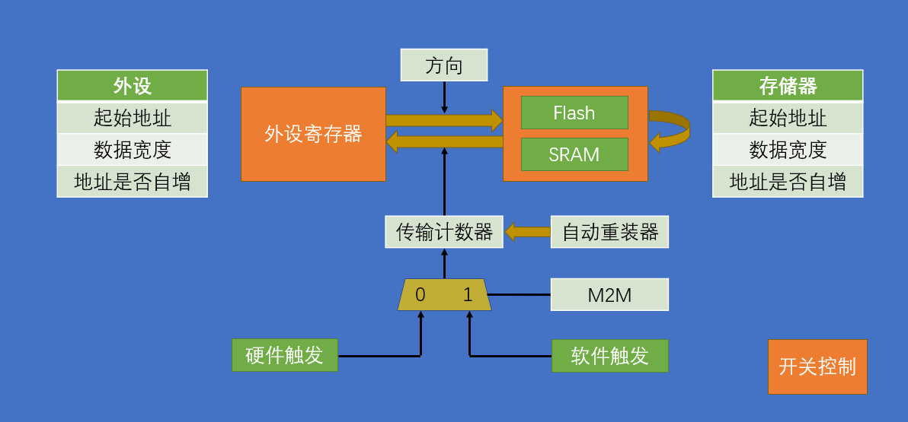
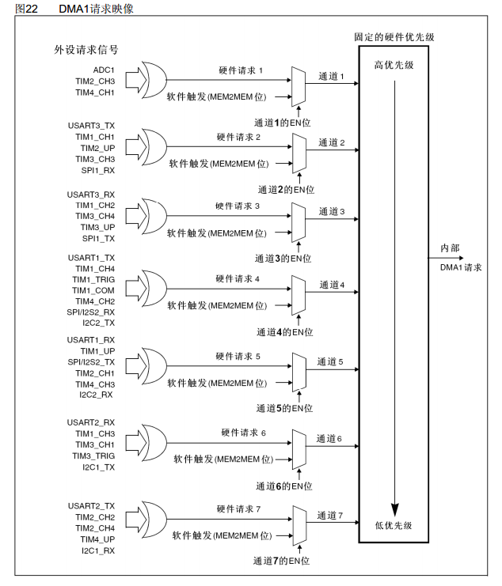

# DMA
# 存储器映像


| 类型  | 起始地址        | 存储器        | 用途                  |
| :-: | ----------- | ---------- | ------------------- |
| ROM | 0x0800 0000 | 程序存储器Flash | 存储C语言编译后的程序代码       |
|     | 0x1FFF F000 | 系统存储器      | 存储BootLoader，用于串口下载 |
|     | 0x1FFF F800 | 选项字节       | 存储一些独立于程序代码的配置参数    |
|     |             |            |                     |
| RAM | 0x2000 0000 | 运行内存SRAM   | 存储运行过程中的临时变量        |
|     | 0x4000 0000 | 外设寄存器      | 存储各个外设的配置参数         |
|     | 0xE000 0000 | 内核外设寄存器    | 存储内核各个外设的配置参数       |


# **DMA 基础概念与工作原理**

## **1. DMA 是什么？**

DMA（Direct Memory Access，直接内存存取）是一种硬件机制，允许外设（如 UART、SPI、ADC、TIM 等）与内存（SRAM、Flash）之间**直接进行数据传输**，而无需 CPU 的干预。

- **核心目的**：将数据传输任务从 CPU 上解放出来，让 CPU 可以专注于执行应用程序代码，大幅提高系统的**效率**和**实时性**。
  

## **2. 工作流程**

1. **CPU 配置**：CPU 负责初始化 DMA 控制器，设置数据源地址、目标地址、数据传输量和传输方向。
   
2. **DMA 请求**：当外设准备好数据（例如 UART 接收到一个字节）或需要发送数据时，它会向 DMA 控制器发出请求（Trigger Event Selection）。
   
3. **总线仲裁**：DMA 控制器向 Cortex-M 内核申请总线控制权。
   
4. **数据传输**：DMA 控制器直接控制总线，完成数据传输。
   
5. **传输完成**：当设定的数据量传输完毕后，DMA 控制器会向 NVIC 发送中断信号（可选），通知 CPU 任务完成。
   
---
## 3. 框图

# **STM32 DMA 核心特性与 HAL 库抽象**

## 0. 基本结构

## **1. DMA 通道和流 (Channel & Stream)**

- STM32 芯片通常有多个 DMA 控制器（DMA1 和 DMA2）。
  
- 每个控制器包含多个**流 (Stream)**（通常 4 到 8 个），每个流可以独立配置。
  
- 每个流可以通过**通道 (Channel)** 映射到特定的外设请求。
  


## **2. 传输方向与模式**

| **特性**     | **模式 (CubeMX/HAL)**  | **描述**                                             | **典型应用**                    |
| ------------ | ---------------------- | ---------------------------------------------------- | ------------------------------- |
| **传输方向** | `Memory to Peripheral` | 从内存到外设。                                       | UART 发送、SPI 发送。           |
|              | `Peripheral to Memory` | 从外设到内存。                                       | UART 接收、ADC 采样。           |
|              | `Memory to Memory`     | 内存块复制（软件触发）。                             | 数据块快速初始化/复制。         |
| **增量模式** | `Memory Increment`     | 传输数据后，内存地址递增。                           | 传输数组。                      |
|              | `Peripheral Increment` | 传输数据后，外设地址递增（通常禁用）。               | 用于 F4/F7 的 FIFO 模式。       |
| **循环模式** | `Circular`             | 传输完成后，DMA 计数器自动重装载，**持续**进行传输。 | 连续 ADC 采样、持续 UART 接收。 |
|              | `Normal`               | 传输完成后停止。                                     | 一次性数据块传输。              |

## **3. 数据宽度 (Data Width)**

HAL 库允许配置数据传输的宽度，通常与外设的数据位宽保持一致：

- **Byte (8-bit)**: 适用于 UART、SPI。
  
- **Half Word (16-bit)**: 适用于 12 位 ADC 结果。
  
- **Word (32-bit)**: 适用于内存到内存传输、ADC 双模式结果。
  


# **STM32CubeMX DMA 配置流程**

## **配置示例1：UART 接收（Peripheral to Memory, Normal Mode）**

这是最基础的 DMA 应用，用于在接收固定长度数据时解放 CPU。

### **CubeMX 步骤**

1. **启用外设**：在 Pinout & Configuration 中配置 **USART1**（异步模式，设置波特率等）。
   
2. **DMA 请求添加**：
   
    - 在 **USART1** 的配置页面中，切换到 **DMA Settings** 选项卡。
      
    - 点击 **Add** $\rightarrow$ 弹出窗口中选择 `USART1_RX`。
      
    - **Direction**：`Peripheral to Memory`。
    
3. **DMA 配置细节**：
   
    - **Mode**：`Normal`。
      
    - **Priority**：`Low` (默认)。
      
    - **Data Width (Memory)**：`Byte` (8 bit)。
      
    - **Data Width (Peripheral)**：`Byte` (8 bit)。
      
    - **Increment Address (Memory)**：`Enable` (接收数据要写入数组的不同地址)。
      
    - **Increment Address (Peripheral)**：`Disable` (USART 的数据寄存器地址固定)。
    
4. **NVIC**：**通常不启用 DMA 中断**，而是使用外设（如 UART 空闲中断）或 HAL 库提供的回调机制。
   

### **HAL 库代码实现**


```c
#define RX_BUFFER_SIZE 100
uint8_t rx_data_buffer[RX_BUFFER_SIZE];

// 在 main() 函数中启动 DMA 接收
// 启动 DMA 接收：接收来自 &huart1 的数据，存入 rx_data_buffer，长度为 RX_BUFFER_SIZE
HAL_UART_Receive_DMA(&huart1, rx_data_buffer, RX_BUFFER_SIZE); 

// **接收完成回调函数（HAL 库抽象）**
// 当 100 字节数据全部接收完毕后，会触发此回调
void HAL_UART_RxCpltCallback(UART_HandleTypeDef *huart)
{
    if (huart->Instance == USART1) {
        // 100 字节数据已完整接收，在此处理数据
        // 注意：DMA 已停止，需要再次启动以接收下一批数据
        HAL_UART_Receive_DMA(&huart1, rx_data_buffer, RX_BUFFER_SIZE); 
    }
}
```

## **配置示例2：ADC 连续采样 (Peripheral to Memory, Circular Mode)**

用于连续、不间断地采集传感器数据，并将结果存入内存缓冲区。

### **CubeMX 步骤**

1. **ADC 配置**：配置 ADC（通道、采样时间等）。
   
2. **DMA 请求添加**：
   
    - 在 **ADC1** 的配置页面中，切换到 **DMA Settings** 选项卡。
      
    - 点击 **Add** $\rightarrow$ 选择 `ADC1`。
    
3. **DMA 配置细节**：
   
    - **Mode**：`Circular` (循环模式)。
      
    - **Data Width (Memory)**：`Half Word` (16 bit，因为 ADC 是 12 位输出)。
      
    - **Data Width (Peripheral)**：`Half Word` (16 bit)。
      
    - **Increment Address (Memory)**：`Enable`。
      
    - **Increment Address (Peripheral)**：`Disable`。
    
4. **NVIC**：可以启用 DMA 中断（如 `DMA1 stream 0 global interrupt`），用于在**半传输**和**全传输**完成时触发回调。
   

### **HAL 库代码实现**


```c
#define ADC_BUF_SIZE 50
uint16_t adc_values[ADC_BUF_SIZE];

// 启动 DMA 连续采样
// 将 ADC 结果连续存入 adc_values 数组，长度为 ADC_BUF_SIZE
HAL_ADC_Start_DMA(&hadc1, (uint32_t*)adc_values, ADC_BUF_SIZE); 

// **全传输完成回调（Full Transfer Complete Callback）**
// 当数组填满时（50个数据）
void HAL_ADC_ConvCpltCallback(ADC_HandleTypeDef *hadc)
{
    if (hadc->Instance == ADC1) {
        // 在循环模式下，DMA 自动重装载并继续，从头覆盖写入，无需再次启动
        // 处理 adc_values 数组中后半部分数据（如果使用了双缓冲或仅处理所有数据）
    }
}

// **半传输完成回调（Half Transfer Complete Callback）**
// 当数组填充到一半时（25个数据）
void HAL_ADC_ConvHalfCpltCallback(ADC_HandleTypeDef *hadc)
{
    if (hadc->Instance == ADC1) {
        // DMA 仍在传输，处理 adc_values 数组中的前半部分数据（实现双缓冲）
    }
}
```

## **配置示例3：内存到内存 (Memory to Memory)**

用于在不需要外设请求的情况下，快速在内存区域之间复制数据。即软件触发。

### **CubeMX 步骤**

1. **DMA 配置**：在左侧配置栏的 **DMA1/DMA2** 选项下，点击 **Add**。
   
2. **请求源**：选择 `MemToMem`。
   
3. **配置细节**：
   
    - **Direction**：`Memory to Memory`。
      
    - **Increment Address (Memory)**：`Enable` (源和目标都需要递增)。
      

### **HAL 库代码实现**


```c
uint8_t source_data[20] = {1, 2, ..., 20};
uint8_t dest_data[20];

// 在 main() 函数中启动 MemToMem 传输
HAL_DMA_Start_IT(hdma_mem2mem, 
                 (uint32_t)source_data, 
                 (uint32_t)dest_data, 
                 20); // 传输 20 个字节

// 传输完成回调
void HAL_DMA_TxCpltCallback(DMA_HandleTypeDef *hdma)
{
    if (hdma->Instance == DMA1_Stream1) {
        // 数据复制完成
    }
}
```

---

# **不用关心**

DMA 和 HAL 库为你抽象了大量的底层细节，因此你**不用关心**：

1. **DMA 寄存器地址**：你不用直接操作 `DMA_SxCR`（控制寄存器）、`DMA_SxNDTR`（数据长度寄存器）等来配置流。HAL 库通过配置句柄（`hdma_...`）自动处理。
   
2. **外设触发信号**：你不用关心外设（如 UART）在硬件上如何向 DMA 控制器发送请求（Request ID）。CubeMX 自动完成了 **Trigger Event Selection** 到 DMA 通道/流的映射。
   
3. **总线仲裁**：你不需要编写代码来处理 DMA 和 CPU 之间的总线竞争。这是由 DMA 硬件逻辑自动管理的。
   
4. **中断标志位清除**：HAL 库的通用 DMA 中断处理函数（`HAL_DMA_IRQHandler`）会自动清除 DMA 相关的中断标志位（如 TCIF, HTIF），然后才调用你的回调函数。
   

---

# **延伸：DMA 中断与错误处理**

虽然在 `Normal` 模式下可以不使用 DMA 中断，但在 `Circular` 模式或需要高可靠性时，DMA 中断非常重要。

|**中断类型**|**描述**|**HAL 回调函数**|**应用场景**|
|---|---|---|---|
|**全传输完成 (TC)**|传输所有数据完成。|`HAL_DMA_TxCpltCallback`|数据处理、任务切换。|
|**半传输完成 (HT)**|传输一半数据完成。|`HAL_DMA_TxHalfCpltCallback`|双缓冲/Ping-Pong 缓冲。|
|**传输错误 (TE)**|传输过程中出现错误（如总线错误）。|`HAL_DMA_AbortCallback`|系统告警、错误恢复。|

**在 CubeMX 中，你只需启用 DMA 对应的 Stream 的 NVIC，HAL 库会自动将这些硬件中断映射到上述回调函数中。**