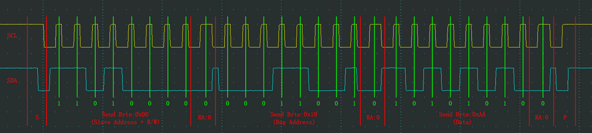

## 一、 I2C 协议简介

I2C（Inter-Integrated Circuit）是由飞利浦公司开发的一种简单的、**双向、二线制、同步串行**总线。

*   **双向**：数据可以在主设备和从设备之间双向传输。
*   **二线制**：仅需要两根信号线——**串行数据线（SDA）** 和**串行时钟线（SCL）**。这极大地减少了芯片管脚数量和PCB走线。
*   **同步**：通信双方通过统一的时钟信号（SCL）来同步数据位（SDA）的传输节奏。
*   **多主从**：总线支持多个主设备（Master）和多个从设备（Slave），通过地址寻址。
*   **低速**：通常用于板内IC之间的短距离通信，速度从标准模式（100kbps）到超快速模式（5Mbps）不等。

## 二、 硬件连接


*   **SDA（Serial Data Line）**：串行数据线，用于传输数据。
*   **SCL（Serial Clock Line）**：串行时钟线，用于产生同步时钟。

所有设备都**并联**在总线上，并且总线接口是**开漏 drain（OD:Output Drain)** 或 **集电极开路（OC）** 结构。规定在SDA和SCL线上各接一个**上拉电阻（Rp）** 到电源VCC，在释放总线时保持**高电平**。

*   **作用**：
    1.  当没有设备主动拉低电平时，由上拉电阻将总线置于高电平（空闲状态）。
    2.  允许不同电压等级的器件在总线上共存（只要它们的VCC不同）。

## 三、 核心概念

1.  **主设备（Master）**
    *   发起和终止传输的设备。
    *   产生时钟信号SCL。
    *   负责寻址从设备。

2.  **从设备（Slave）**
    *   被主设备寻址的设备。
    *   响应主设备的命令。

3.  **地址（Address）**
    *   每个从设备都有一个唯一的7位或10位地址，用于主设备的寻址。
    *   **7位地址**是最常见的格式，理论上可连接127个设备（地址0x00保留，有些地址有特殊用途）。
    *   **10位地址**用于扩展更多设备。

4.  **速度模式**
    *   **标准模式（Standard-mode）**： 100 kbit/s
    *   **快速模式（Fast-mode）**： 400 kbit/s
    *   **快速模式+（Fast-mode Plus）**： 1 Mbit/s
    *   **高速模式（High-speed mode）**： 3.4 Mbit/s
    *   **超快速模式（Ultra Fast-mode）**： 5 Mbit/s

## 四、 通信流程与帧格式

一次完整的I2C通信包含以下几个部分：

**起始条件（START） -> 从机地址帧（Address Frame）+ 读写位（R/W#）+ 应答位（ACK/NACK） -> 数据帧（Data Frames）+ 应答位（ACK/NACK） -> 停止条件（STOP）**

---

![[../图源/I2C-Bits-Protocol.jpg]]
### 1. 起始（S）和停止（P）条件


*   **起始条件（S）**： 当SCL为高电平时，SDA线出现一个**下降沿**。
    *   表示一次传输的开始。


*   **停止条件（P）**： 当SCL为高电平时，SDA线出现一个**上升沿**。
    *   表示一次传输的结束。


> **注意**：在SCL为高期间，SDA的稳定变化被用于表示起始和停止条件，在数据传输期间，SDA的变化必须发生在SCL为低时。

### *基本单元


### 2.**地址帧 + 读写位**

起始条件后，主设备发送的第一个字节是**地址帧**。

*   **7位地址格式**：
    *   这个字节由 **7位从机地址** 和 **1位读写控制位（R/W#）** 组成。
    *   **位序**： **MSB（最高有效位）先行**。
    *   **R/W#位**：
        *   **0**： 表示主设备**写（Write）** 数据到从设备。
        *   **1**： 表示主设备**读（Read）** 从设备的数据。

| BIT 7 | BIT 6 | BIT 5 | BIT 4 | BIT 3 | BIT 2 | BIT 1 | BIT 0 | 描述 |
| :--- | :--- | :--- | :--- | :--- | :--- | :--- | :--- | :--- |
| A6 | A5 | A4 | A3 | A2 | A1 | A0 | R/W# | 7位地址 + 读写位 |

### 3. 应答（ACK）与非应答（NACK）位


每个字节（包括地址帧和所有数据帧）传输完毕后，后面都紧跟着一个应答位。

*   **时钟**： 应答位由接收方在**第9个时钟脉冲**期间控制SDA线。
*   **应答（ACK）**：
    *   接收方将SDA线**拉低**。
    *   表示接收方已成功接收到该字节，并准备好接收下一个字节。
*   **非应答（NACK）**：
    *   接收方**保持SDA线为高**。
    *   表示：
        1.  接收方未成功接收数据（如CRC错误）。
        2.  接收方无法接收更多数据。
        3.  主设备在读操作时，发送NACK来告知从设备这是最后一个要读取的字节，随后主设备应产生停止条件。

### 4. 数据帧

地址帧被应答后，开始传输数据帧。

*   每个数据帧为**8位（1个字节）**。
*   同样是**MSB先行**。
*   每个数据帧后都紧跟着一个应答位（ACK/NACK），由**数据接收方**发出。
    *   **写操作**： 从设备是接收方，故从设备发ACK。
    *   **读操作**： 主设备是接收方，故主设备发ACK。

## 五、 完整的通信序列

### 主设备向从设备写入字节

1.  主设备产生**起始条件（S）**。
2.  主设备发送**7位从机地址 + 写位（0）**。
3.  从设备返回**应答位 ACK（0）**。
4.  主设备发送**8位数据**（通常是寄存器地址或者命令）。
5.  从设备返回**应答位 ACK（0）**。
6.  主设备发送**8位数据**（指针自动后移一个字节）。
7.  从设备返回**应答位 ACK（0）**。
8.  ...(重复5~6，直到数据发送完毕)
9.  主设备产生**停止条件（P）**。

#### 单字节实例

#### 

### 主设备从从设备读取字节

1.  主设备产生**起始条件（S）**。
2.  主设备发送**7位从机地址 + 读位（1）**。
3.  从设备返回**应答位 ACK（0）**。
4.  从设备发送**8位数据**（数据基于上次通信时的内存地址指针）。
5.  主设备返回**应答位 ACK（0）**。
6.  从设备发送**8位数据**（指针自动后移一个字节）。
7.  主设备返回**应答位 ACK（0）**。
8. ...(重复6~7)
9.  从设备发送**8位数据**
10.  主设备返回**非应答位 NACK（1）**（结束读取）。
11.  主设备产生**停止条件（P）**。


### 复合格式（最常用）

主设备先写入从设备的**内部寄存器地址**，然后重新启动并读取数据。这在操作传感器、EEPROM等设备时非常常见。

1.  主设备产生**起始条件（S）**。
2.  主设备发送**7位从机地址 + 写位（0）**。
3.  从设备返回**ACK**。
4.  主设备发送**要写入的寄存器地址（例如 0x00）**。
5.  从设备返回**ACK**。
6.  主设备产生**重复起始条件（Sr）**（功能和起始条件S一样，但不会先产生停止条件）。
7.  主设备发送**7位从机地址 + 读位（1）**。
8.  从设备返回**ACK**。
9.  从设备发送**寄存器0x00中的数据**。
10. 主设备返回**NACK**（表示读取结束，也可向上面例子一样，返回0，直到读完所有数据再返回1）。
11. 主设备产生**停止条件（P）**。
![[../图源/I2C指定地址读.png]]

## 六、 时钟拉伸（Clock Stretching）

*   在传输过程中，从设备如果来不及处理（例如正在处理中断），它可以**在SCL线上执行时钟拉伸**。
*   具体做法是：从设备在接收到一个位后，**主动拉低SCL线**，强制将时钟保持为低电平。这会**暂停**整个通信，直到从设备准备好并释放SCL线，时钟才恢复为高。
*   这是一种从设备控制通信节奏的流控机制。

**波形示意图：**
```
SDA   ___/X_X_X_X_..._X_X_________________...
SCL   ~~~|_|_|_|_|...|_|\\\\\\\\\\________... (从机拉低SCL)
        |             | |        |
     正常时钟        从机开始   从机释放SCL，
                      拉伸时钟   通信继续
```

## 七、 总结与要点

| 项目 | 描述 |
| :--- | :--- |
| **信号线** | SDA（数据）， SCL（时钟） |
| **拓扑** | 所有设备并联，需上拉电阻 |
| **寻址** | 7位或10位地址，支持多主从 |
| **起始条件** | SCL高时，SDA下降沿 |
| **停止条件** | SCL高时，SDA上升沿 |
| **数据有效性** | SCL高期间，SDA必须保持稳定 |
| **数据变化** | SCL低期间，SDA可以变化 |
| **字节格式** | 8位数据，MSB先行，后跟1位ACK/NACK |
| **ACK** | 接收方拉低SDA，表示成功 |
| **NACK** | 接收方不拉低SDA，表示失败或结束 |
